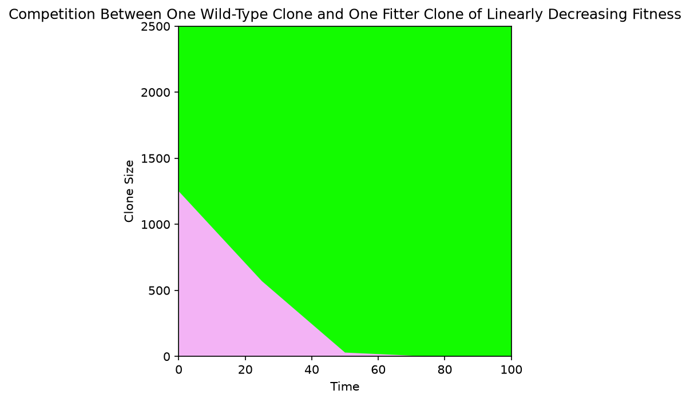
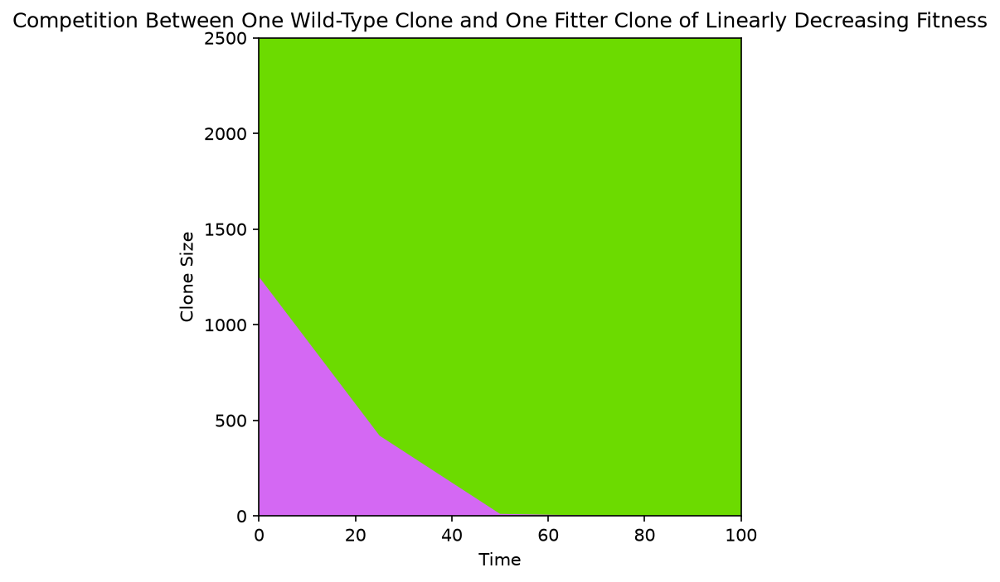
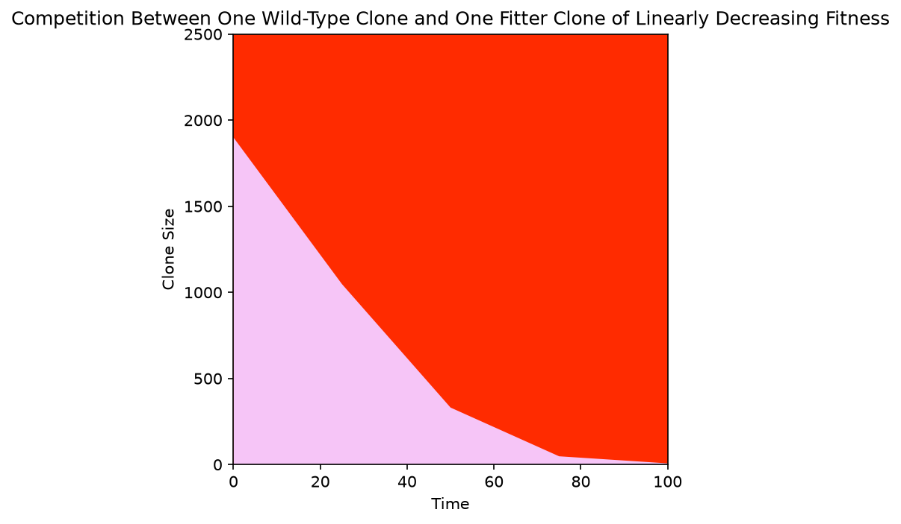
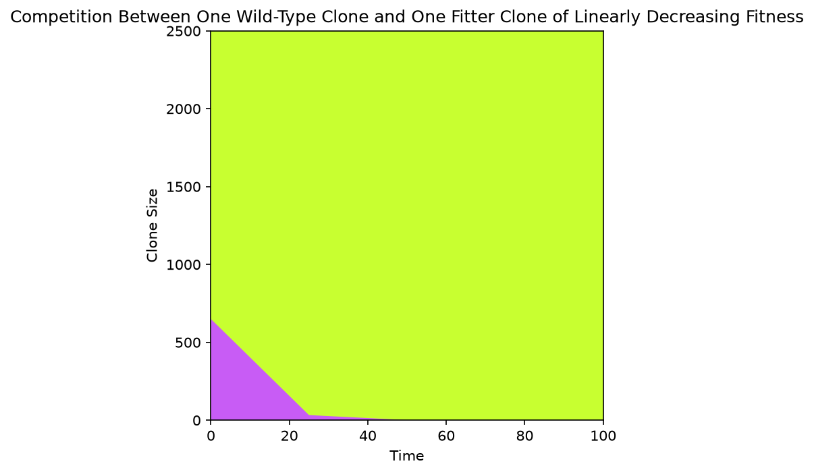

# Muller Plots WF2D

Comparing 1 wild-type clone and 1 higher-fitness clone, using a
linear decreasing fitness function for the non-wild-type clone.
This is using a WF2D simulation, and we are varying between having a cell in 
its own neighbourhood and not

| Wild-type cells | Mutant cells | Cell in own neighbourhood | Plot |
|---|---|---|---|
| 500 | 500 | True     | .     |
| 500 | 500 | False    | .     |
| 250 | 750 | True     |      |
| 750 | 250 | False    |       |

