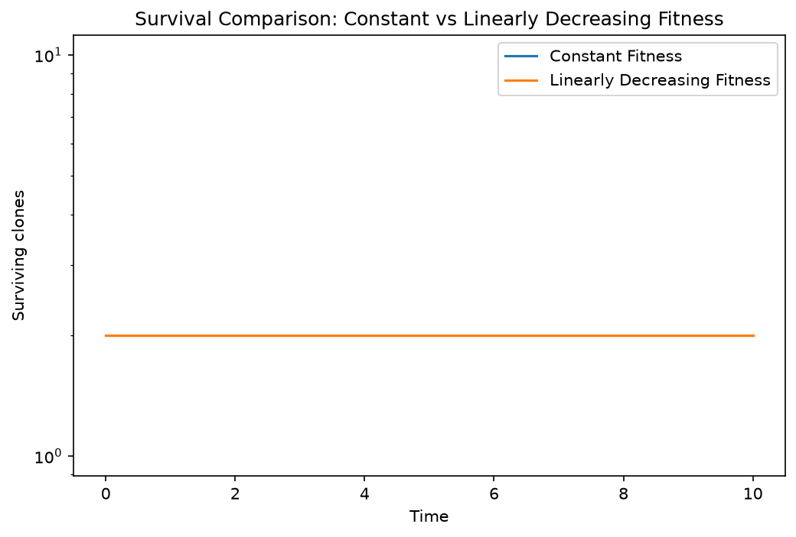
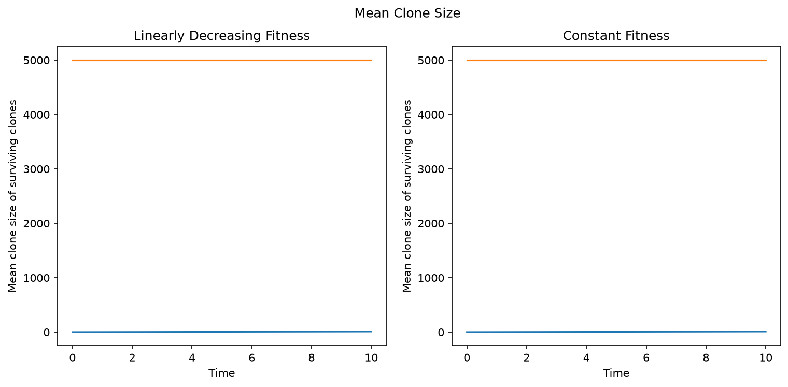
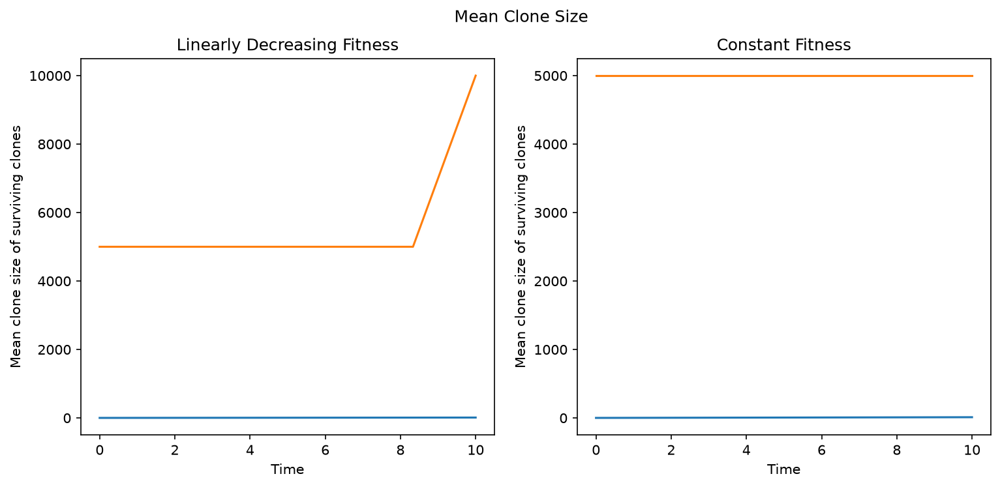
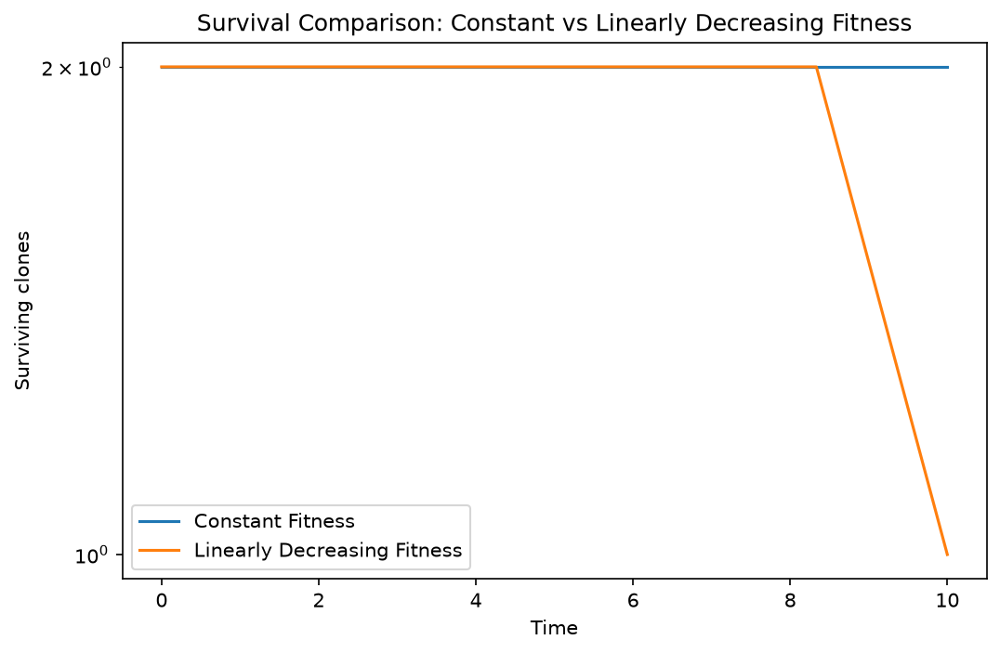

# Table showing constant fitness versus linearly decreasing fitness for specified number of clones (and specified number of wild-types)

# Non-Spatial Wright-Fisher: Only two different types of clone in these following simulations (1 wild-type, 1 fitter)

| Total no. of clones | % of wild-types | Fitness of non-wild-type |  Muller Plot  |  Mean Clone Size  | Clone Survival
|---|---|---|---|---|---|
| 10000  |   50    |    1.3     |       |        |        |
| 10000  |   10    |    1.3     |       |        |        |
| 10000  |   1.0   |    1.3     |        |         |         |
| 10000  |   50    |    1.15    |      |       |       |
| 10000  |   10    |    1.15    |      |       |       |
| 10000  |   50    |    1.05    |      |       |       |
| 10000  |   10    |    1.05    |      |       |       |

# Non-Spatial Moran: Only two different types of clone in these following simulations (1 wild-type, 1 fitter)

| Total no. of clones | % of wild-types | Fitness of non-wild-type |  Muller Plot  |  Mean Clone Size  | Clone Survival |
|---|---|---|---|---|---|
| 10000  |   50    |    1.3     |       |        |        |
| 10000  |   10    |    1.3     |       |        |        |
| 10000  |   1.0   |    1.3     |        |         |         |

# Starting fitnesses are selected using a Gaussian distribution

| Constant Fitness? | No. of clones | Muller Plot | Clone Survival | Mean Clone Size | Mean Fitness and SD |
|---|---|---|---|---|---|
| Yes | 100  |      |        |    | 1.3, 0.1 |
| No  | 100  |        |         |      | 1.3, 0.1 |  
| Yes |  10000 |  |    |   |  1.3, 0.1      |
| No  |  10000 |    |      |     |  1.3, 0.1      |

# Plots showing the comparison of clone survival rate between a simulation using linearly decreasing fitness and one which has constant fitness

| No. of clones | Percentage of Cells Which Are Wild-Types | Clone Survival Plot | Time Steps |
|---|---|---|---|
| 10000 |   0.1     |       |  100    |
| 10000 |   0.1     |                 |  1000   |
| 10000 |   1.0     |            |  1000   |
| 10000 |   10.0    |           |  1000   |
| 10000 |   50.0    |           |  1000   |

# Spatial Plots (using WF2D)

| Constant Fitness? | No. of clones | Muller Plot | Clone Survival | Mean Clone Size | Mean Fitness and SD |
|---|---|---|---|---|---|

