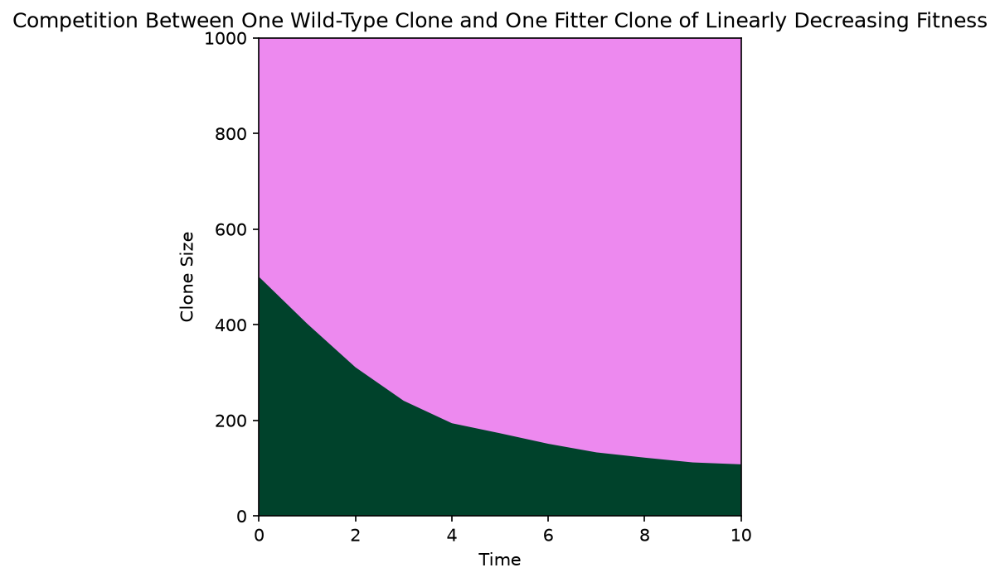
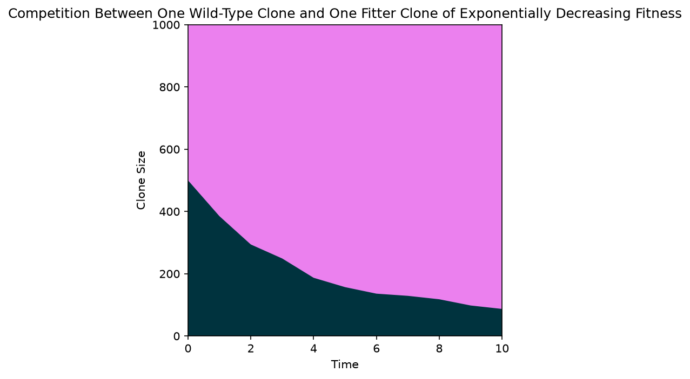
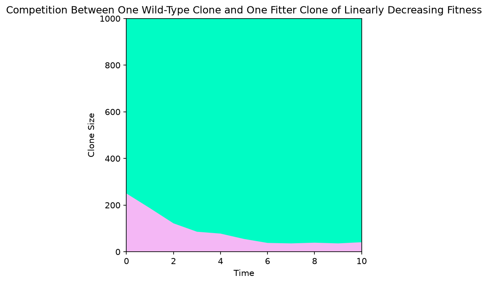
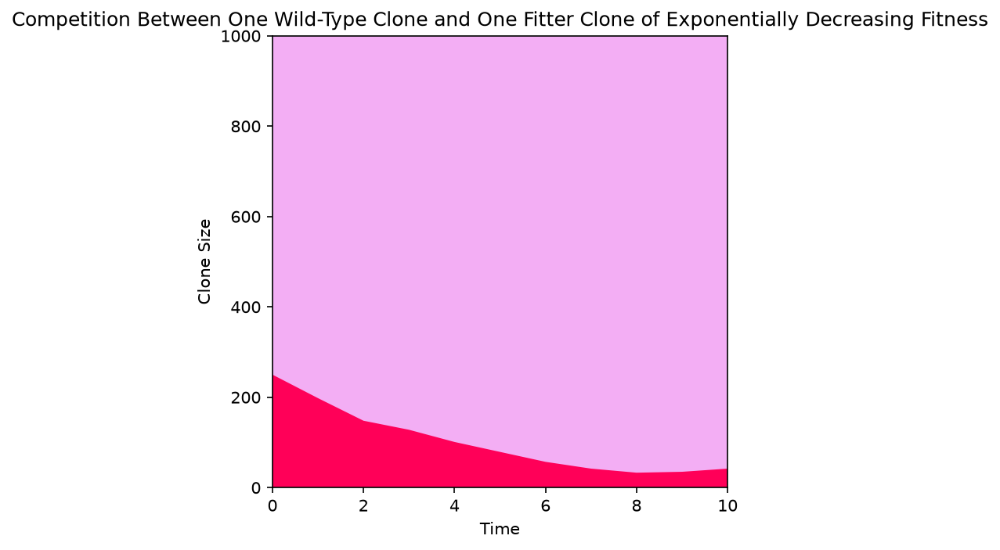
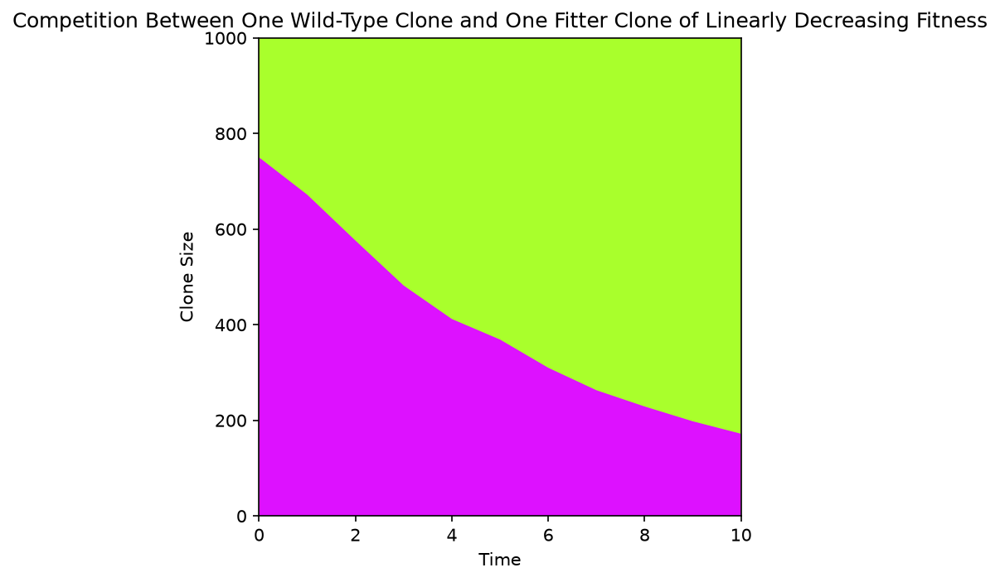
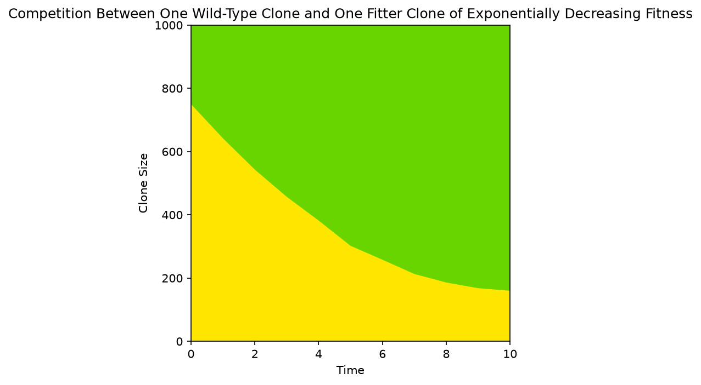

# Muller Plots

Comparing 1 wild-type clone and 1 higher-fitness clone, using either a
linear or exponential (decreasing) fitness function for the non-wild-type clone.

| Wild-type cells | Mutant cells | Fitness function | Plot |
|---|---|---|---|
| 500 | 500 | Linear      |       |
| 500 | 500 | Exponential |  |
| 250 | 750 | Linear      |       |
| 250 | 750 | Exponential |  |
| 750 | 250 | Linear      |       |
| 750 | 250 | Exponential |  |

