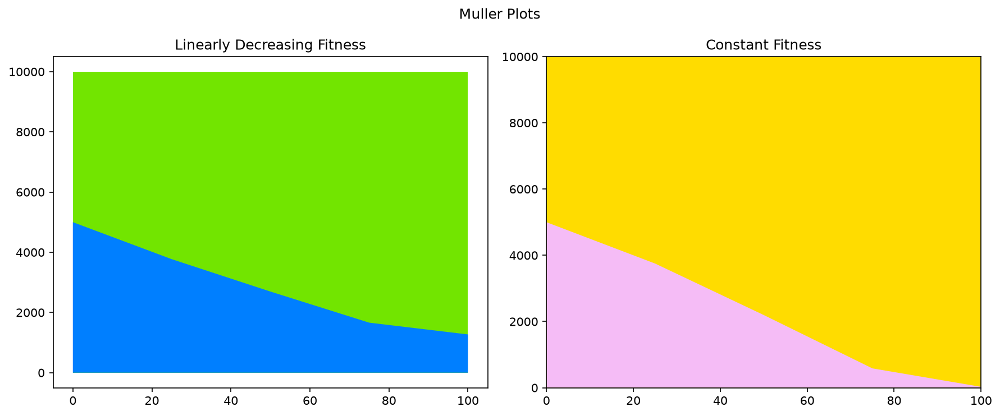
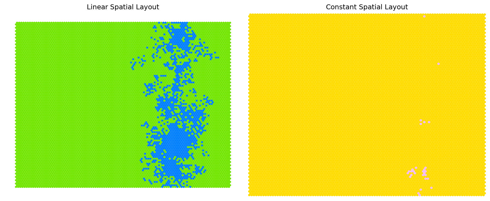
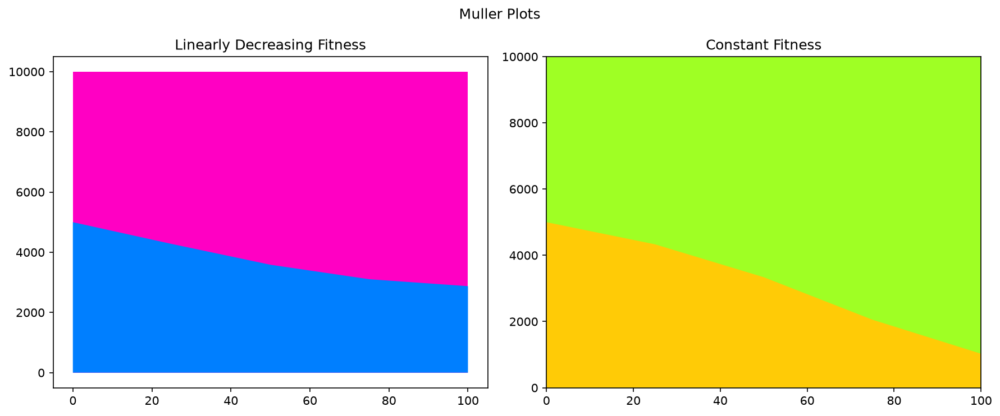
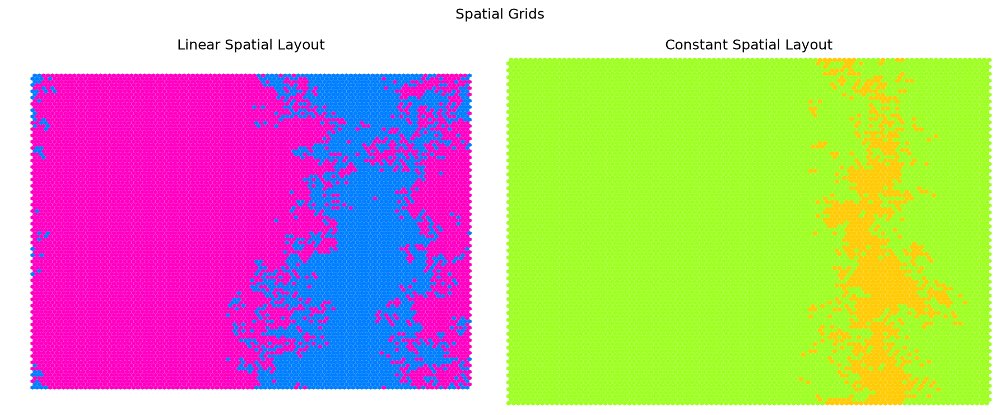
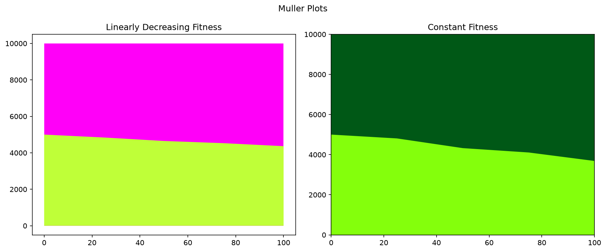
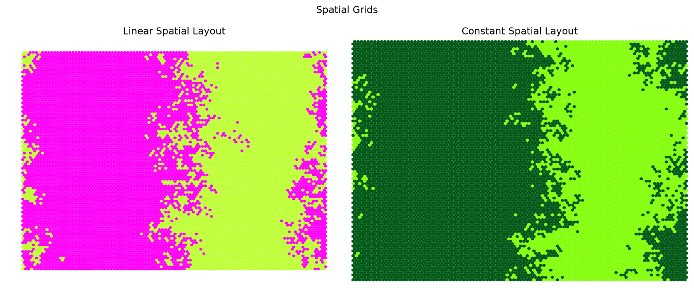

# Non-Neutral Simulations: Modelling the difference between a large clone of wild-types and a variety of non-neutral single-cell clones, all of the same fitness. In the two simulations, we show the difference between non-neutral clones which hold a constant fitness and those which have linearly decreasing fitness (ending the simulation at a wild-type  fitness of 1)

Using WF algorithm:

| Total cells | No. of cells in wild-type clone | No. of non-neutral cells | Fitness of non-neutral cells | Muller Plot | Mean Clone Size | Clone Survival |
|---|---|---|---|---|---|---| 
| 10000 |     9950      |    50    |     1.3     |       |     |      | 
| 10000 |     9900      |    100   |     1.3     |      |    |     | 
| 10000 |     9900      |    100   |     1.15     |      |    |     | 
| 10000 |     9900      |    100   |     1.05     |      |    |     | 

| Total cells | No. of cells in wild-type clone | No. of non-neutral cells | Fitness of non-neutral cells | Muller Plot | Spatial Grid | 
|---|---|---|---|---|---|
| 100 |   50   |   50  |   1.3   |        |       |
| 100 |   50   |   50  |   1.15  |       |      |
| 100 |   50   |   50  |   1.05  |       |      |

Using Moran algorithm: 

| Total cells | No. of cells in wild-type clone | No. of non-neutral cells | Fitness of non-neutral cells | Muller Plot | Spatial Grid | 
|---|---|---|---|---|---|
| 100 |   50   |   50  |   1.3   |        |       |
| 100 |   50   |   50  |   1.15  |        |       |

