# Storing the results and plots from the exponential, linear and step function runs

Using the grid search sweep algorithm to find fitness and induction ONLY, we have shown that this results in a bad fit for the TP53 mouse data. In the following simulations, we have added in the search for an extra variable besides just fitness and induction. In the step function, we search for a time at which the fitness drops immediately from its starting value to neutral. In exponential, we search for a value for the exponential coefficient of fitness and in the linear function, we search for a value for the linear coefficient of fitness.

In each of the sections below you can see how these additional searches have sometimes improved the fit of the simulation to the real data points, and how sometimes it has not. You can see the probability distributions we have found for the different parameters, and both 2D and 3D plots showing heatmaps for maximum likelihood for the parameters. 

## Step Function Simulation
| best fit w/o feedbacks | best fit with feedbacks | best fit with and w/o feedbacks | marginals coarse 2d | marginals tight 2d | marginals 3d | surface plot fit-ind | surface plot fit-time | surface plot ind-time |
|---|---|---|---|---|---|---|---|---|
| 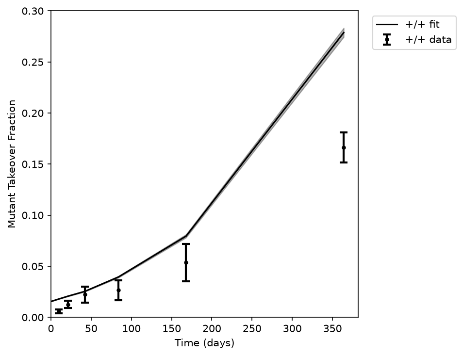| 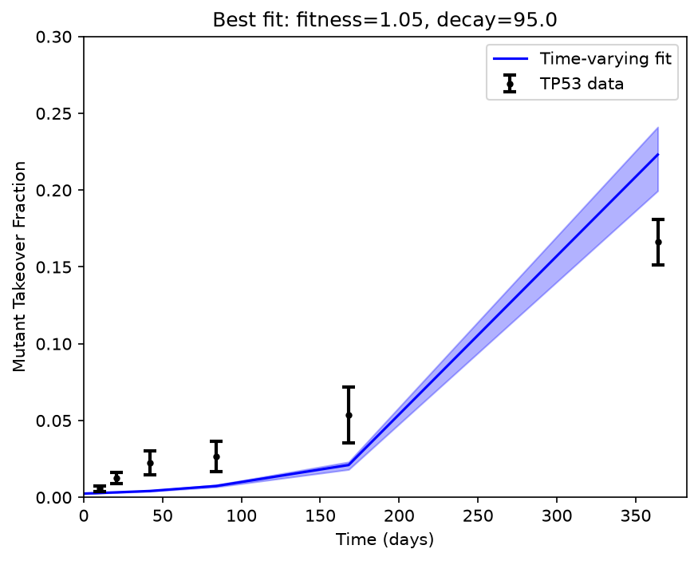 | 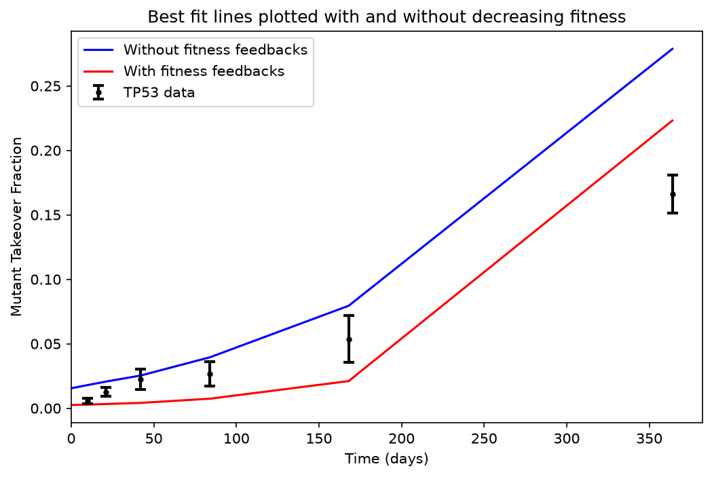 | 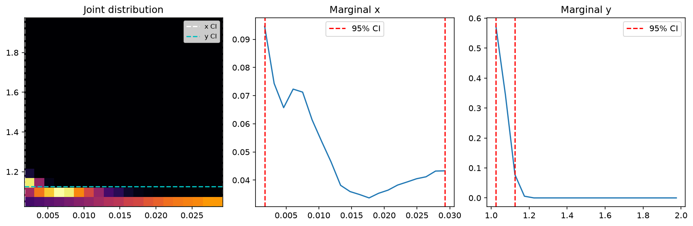 |  | 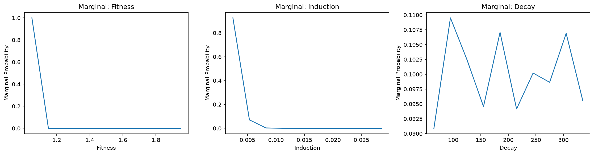 |  | 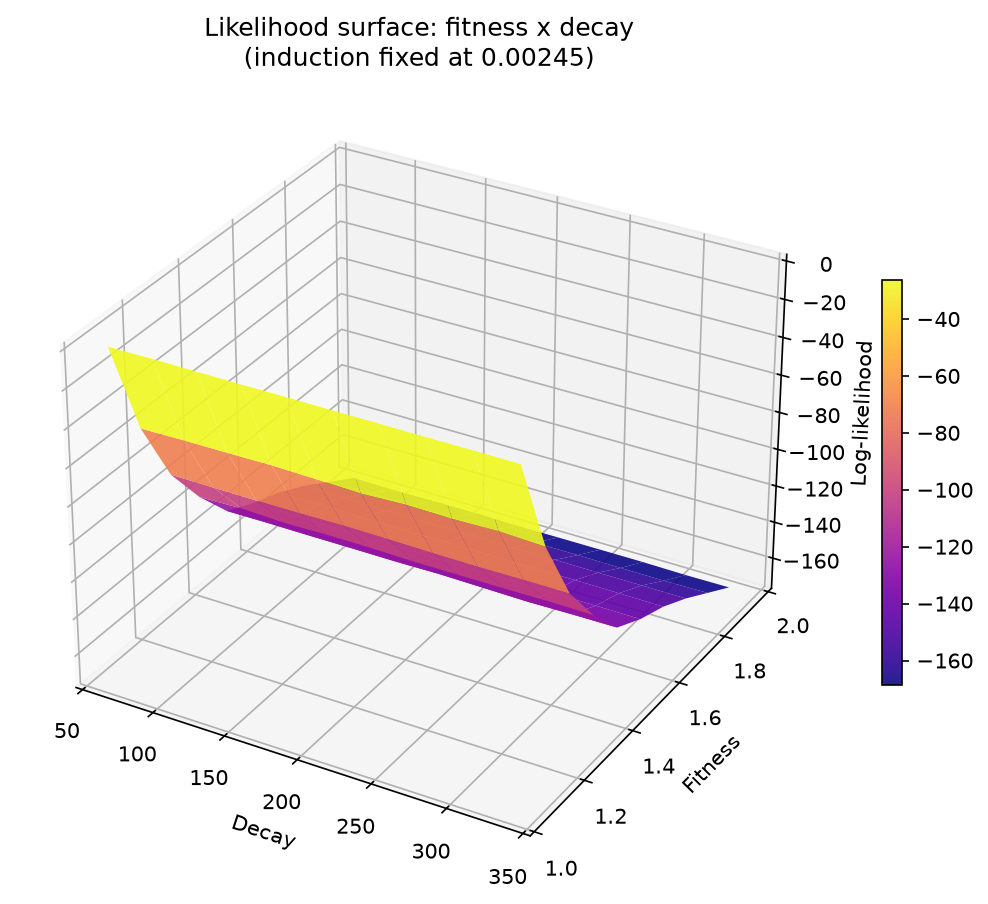 |  |

## Exponential Function Simulation 
| best fit w/o feedbacks | best fit with feedbacks | best fit with and w/o feedbacks | marginals coarse 2d | marginals tight 2d | marginals 3d | surface plot fit-ind | surface plot fit-dec | surface plot ind-dec |
|---|---|---|---|---|---|---|---|---|
| | 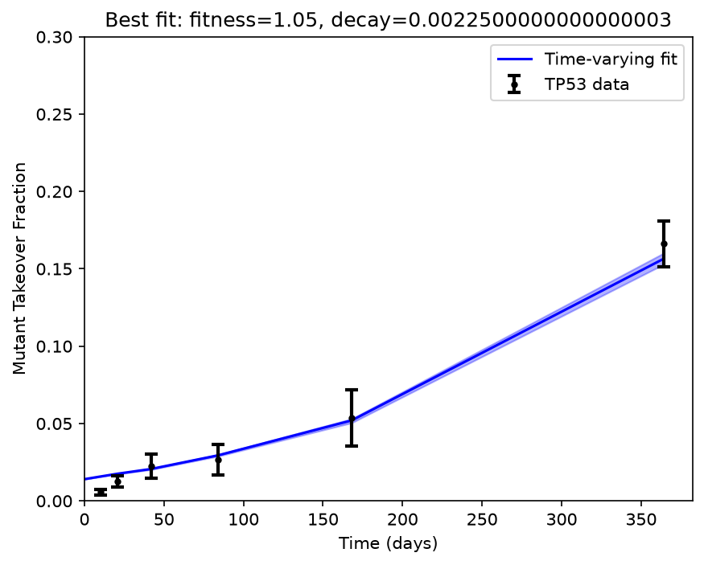 |  |  | 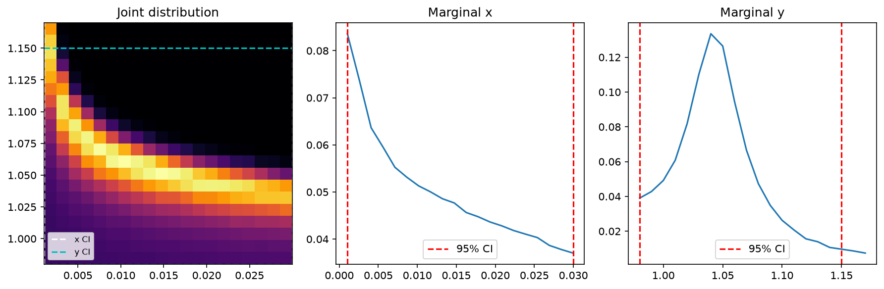 |  |  |  |  | 

## Linear Function Simulation 
| best fit w/o feedbacks | best fit with feedbacks | best fit with and w/o feedbacks | surface plot fit-ind | surface plot fit-dec | surface plot ind-dec | marginals 3d |
|---|---|---|---|---|---|---|
| | 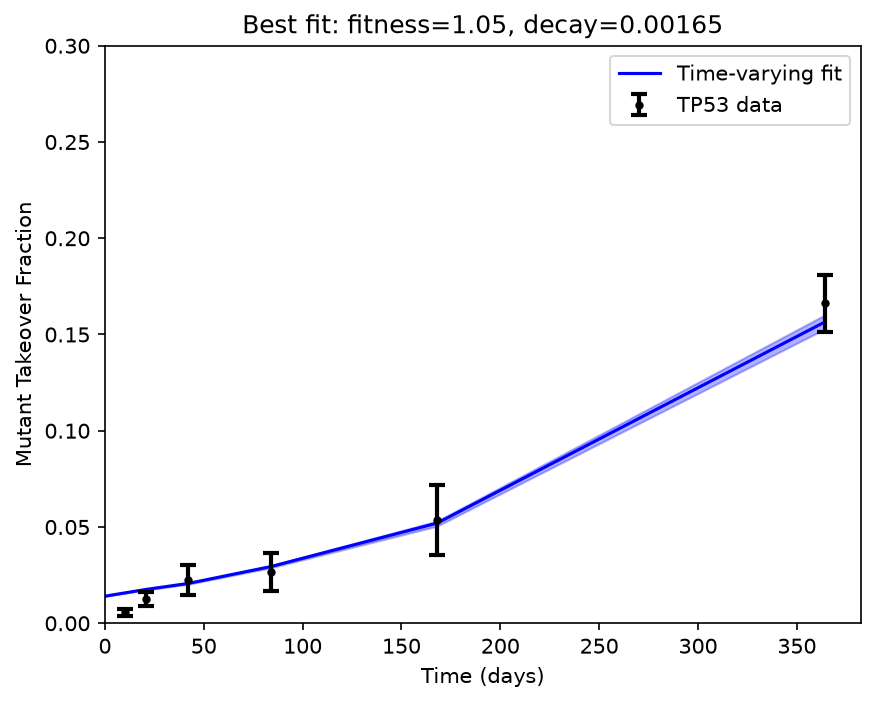 |  |  |  | 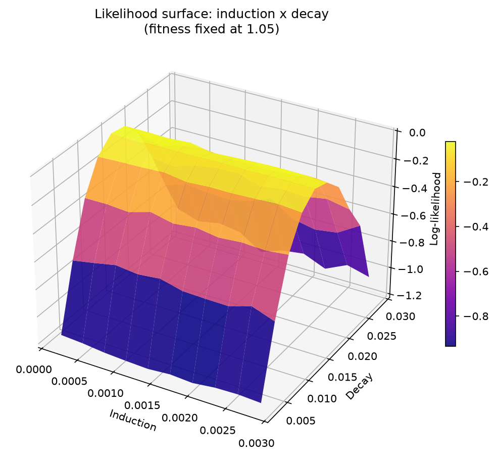 | 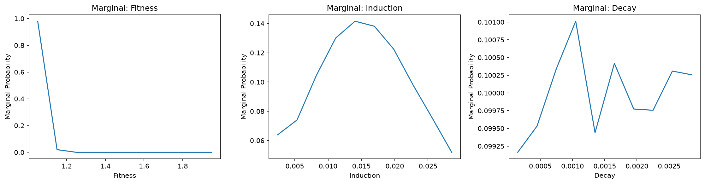 |

## Linear Heatmaps and marginals without using feedbacks:
| heatmap loglikelihood tight | heatmap probability tight | marginals coarse 2d | marginals tight 2d |
|---|---|---|---|
|    |  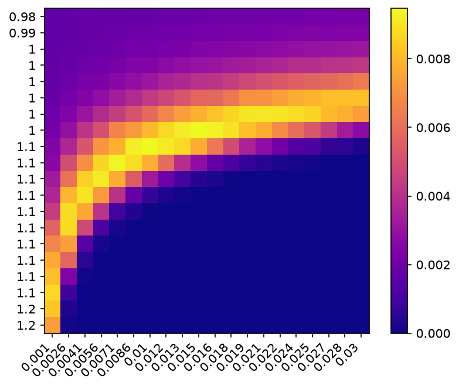  |  |  |

## Showing the difference between the models

| % Wild-type | Fitness of Mutants | Muller Plots | Mean Clone Size | Survival Rate |
|---|---|---|---|---|
| 90 | 1.05 |  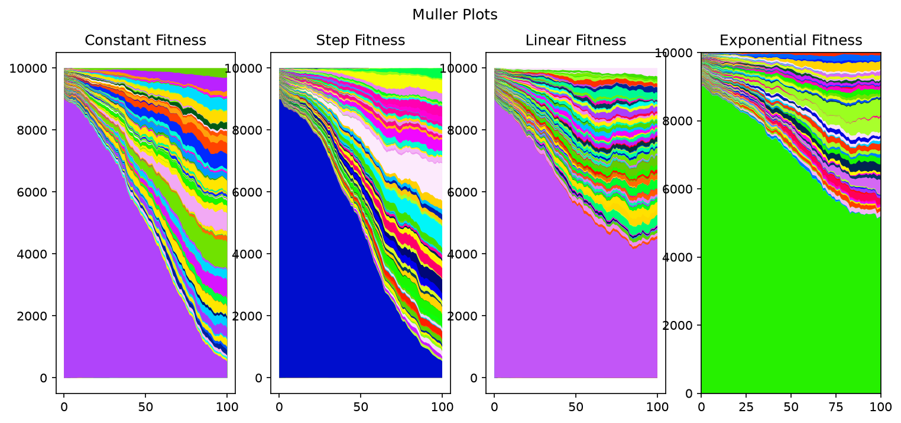  |  |   |
| 90 | 1.15 |    |  |  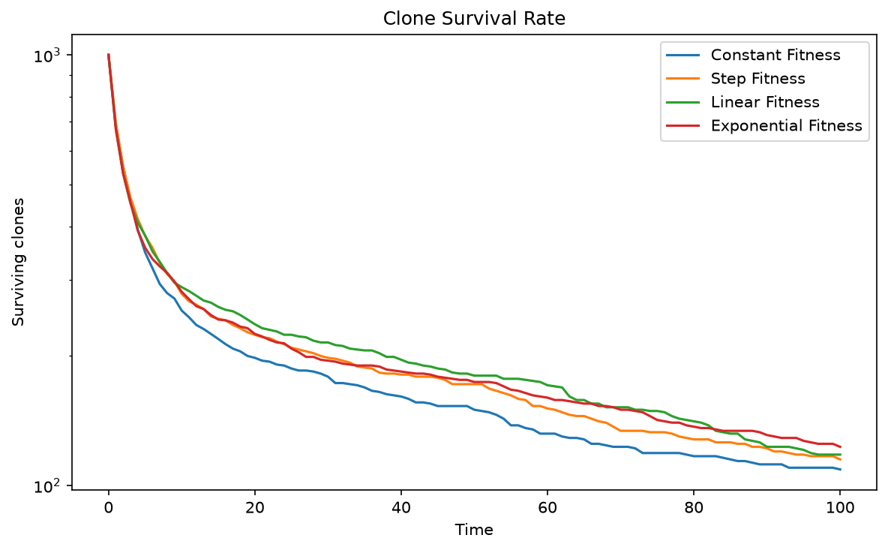 |

# Residuals
| Residuals Plot |
|---|
| 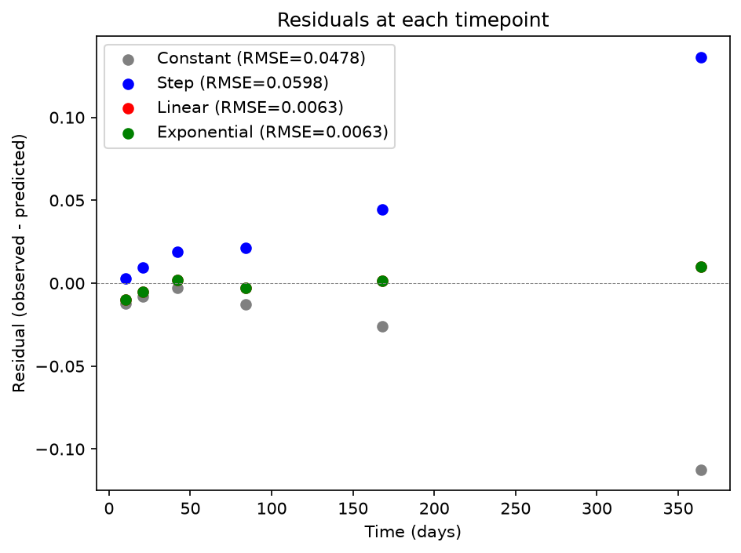 |

