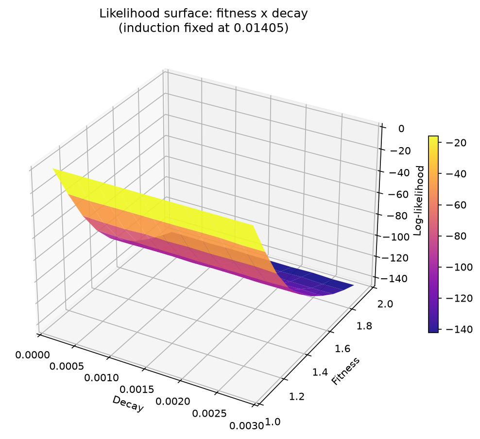
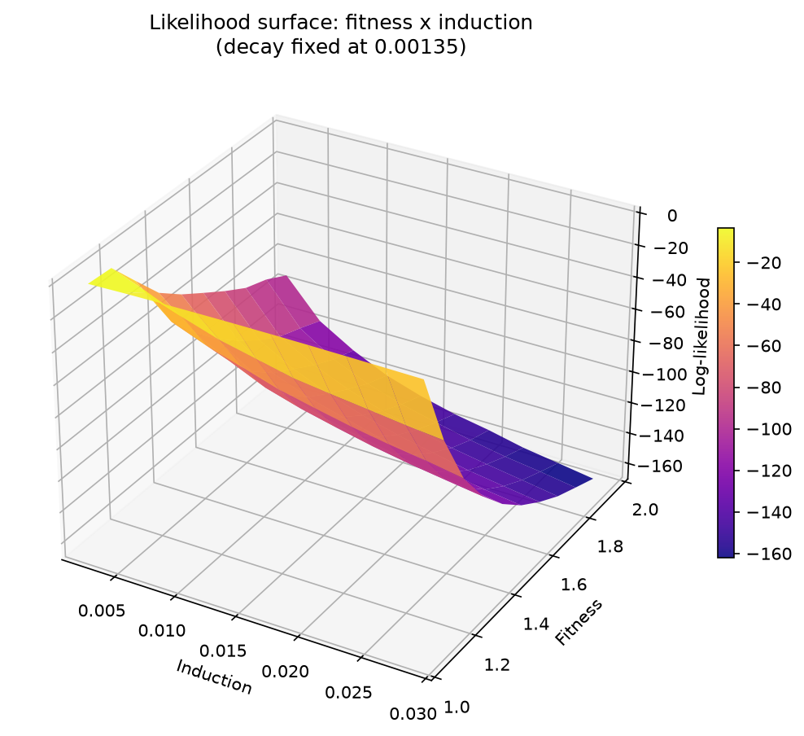
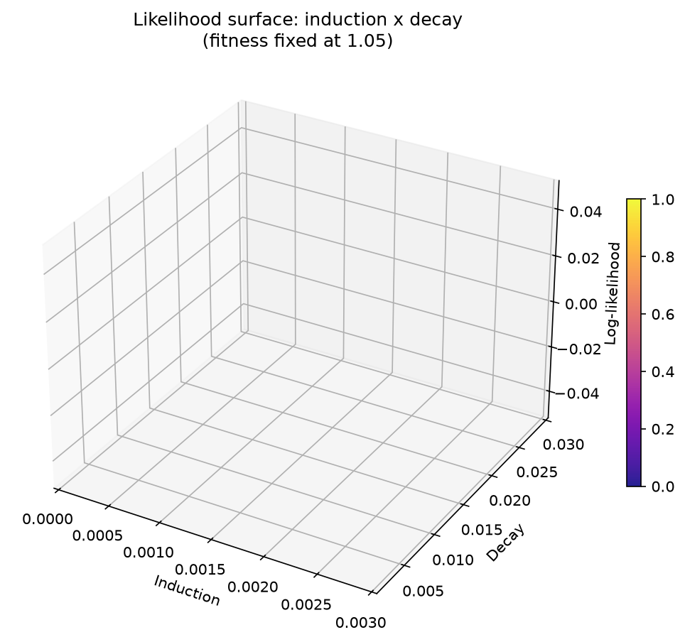
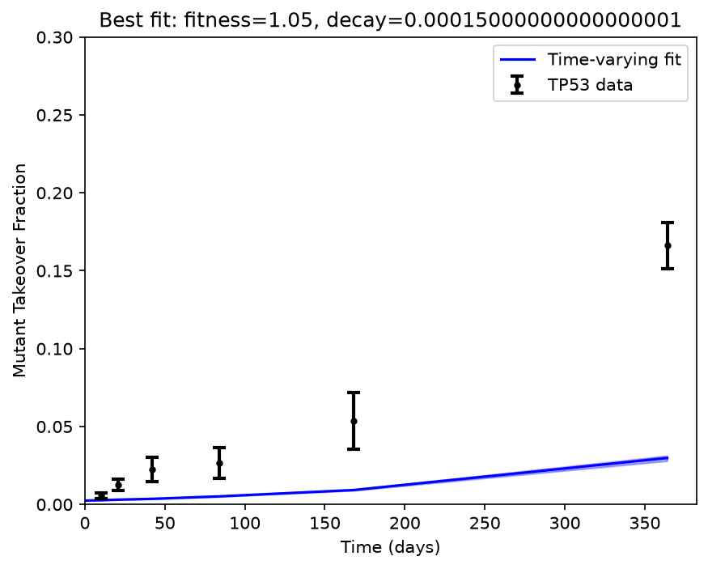
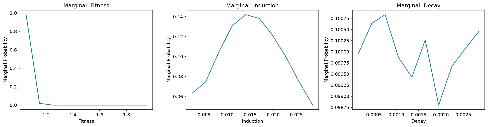
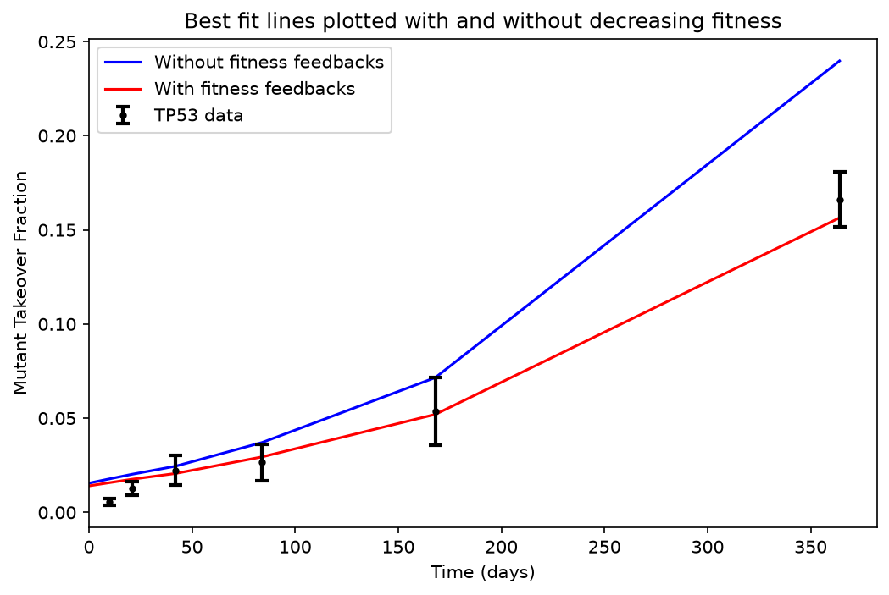

# Plots showing heatmaps for the probability distributions finding fitness and induction 
## This is without any fitness feedbacks
| Heatmap Loglikelihood | Heatmap Probability | Marginals Distributions Coarse | Heatmap Loglikelihood Tight | Heatmap Probability Tight | Marginals Distributions Tight | Best Fit Plot |
|---|---|---|---|---|---|---|
|  |  |  |  |  |  |  |

## In the following plots we are using linear fitness feedbacks

| Heatmap Fitness-Decay | Heatmap Fitness-Induction | Heatmap Induction-Decay | Best Fit Plot | 
|---|---|---|---|
|  |  |  |  | 

## In the following plots we are using exponential fitness feedbacks
| Heatmap Fitness-Decay | Heatmap Fitness-Induction | Heatmap Induction-Decay | Best Fit Plot | Marginal Plots |
|---|---|---|---|---|
|  |  |  |  |    |

# Best fit plots with and without feedbacks
|Best Fit Plots |
|---|
|  |

