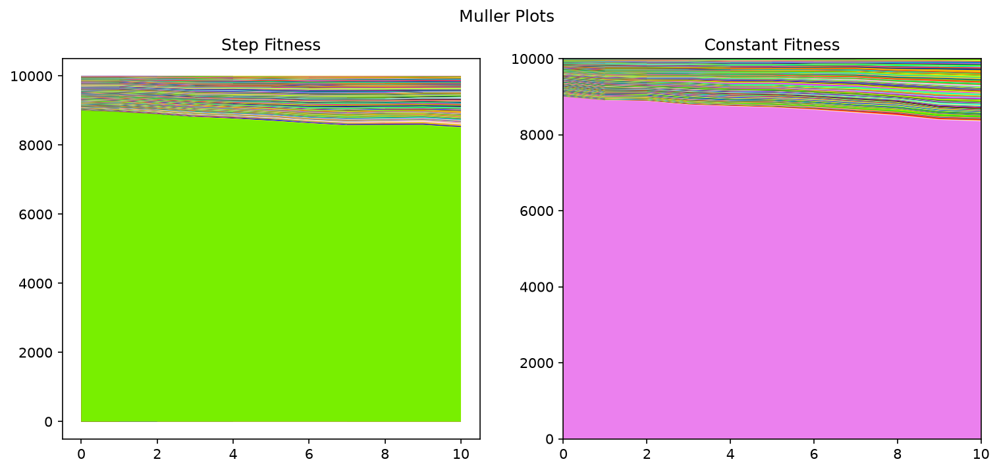
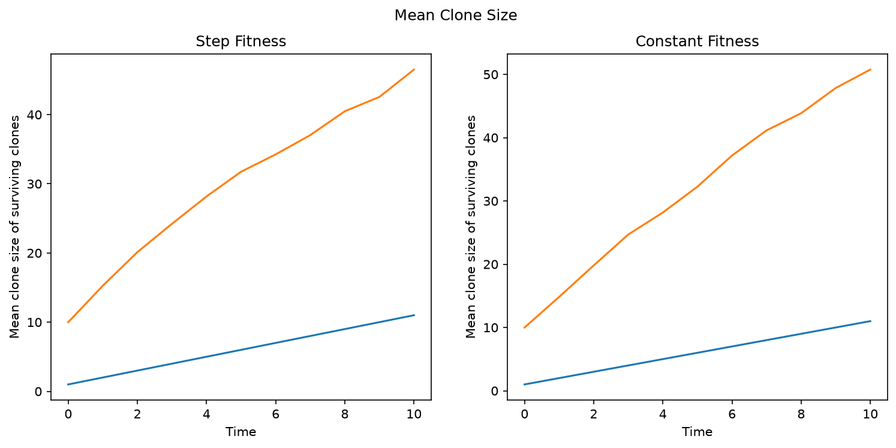
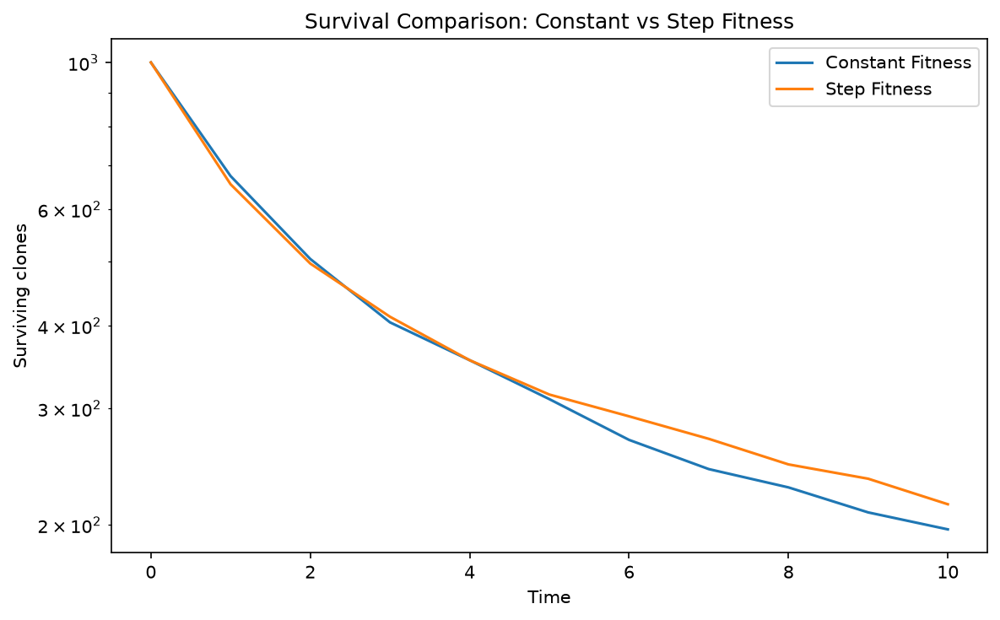

# Creating a markdown file to hold the plots of my new subclass WFStepFitness

| No. wild-types | No. mutants | Initial Fitness of mutants | Time when fitness drops to neutral | Muller Plot | Mean Clone Size | Clone Survival |
|---|---|---|---|---|---|---|
|  9000  |  1000  |   1.05  |  5  |  |  |  |

|  9000  |  1000  |   1.05  |  5  |  |  |  |
|  9000  |  1000  |   1.05  |  5  |  |  |  |
|  9000  |  1000  |   1.05  |  5  |  |  |  |

